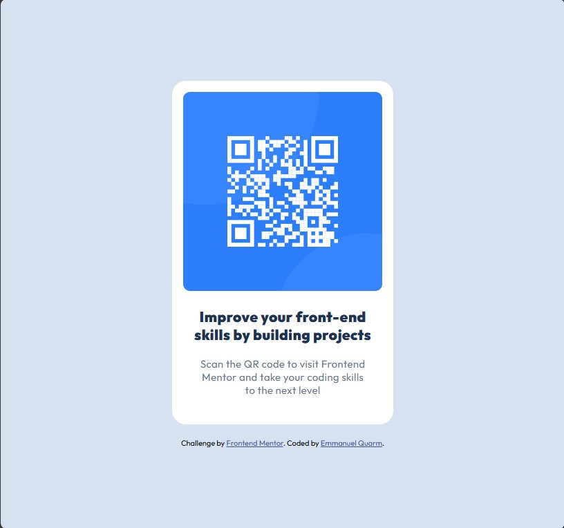

# Frontend Mentor - QR code component solution

This is a solution to the [QR code component challenge on Frontend Mentor](https://www.frontendmentor.io/challenges/qr-code-component-iux_sIO_H). Frontend Mentor challenges help you improve your coding skills by building realistic projects. 

## Table of contents

- [Overview](#overview)
  - [Screenshot](#screenshot)
  - [Links](#links)
- [My process](#my-process)
  - [Built with](#built-with)
  - [What I learned](#what-i-learned)
  - [Continued development](#continued-development)
  - [Useful resources](#useful-resources)
- [Author](#author)
- [Acknowledgments](#acknowledgments)


## Overview

### Screenshot




### Links

- Solution URL: (https://www.frontendmentor.io/solutions/qr-code-component-using-semantic-html5-markup-hyq5by2RcY)
- Live Site URL: (https://bigboyemma20.github.io/qr-code-component-main/)

## My process

### Built with

- Semantic HTML5 markup
- CSS custom properties(variables)
- Flexbox layout
- Mobile-first responsive design
- Google fonts - Outfit


### What I learned

This project has helped me in  understanding of best practices in HTML structure and using CSS custom properties. I also got some valuable skills, like centering elements on the page with Flexbox and applying spacing through padding, border-radius, and letter-spacing.

css sample
```css
body{
    
    display: flex;
    flex-direction: column; 
    align-items: center;  
    justify-content: center;
    background-color: var(--Slate300);   
    text-align: center;
    min-height: 100vh;
}


.card {
    width: 320px;
    overflow: hidden;
    background-color: var(--White);
    border-radius: 20px;
    padding: 16px 16px 40px 16px;
}


### Continued development

I will continue to explore more projects to enhance my skills in flex layouts and also improve on my css knowledge. 

### Useful resources


## Author

- My Github - [Emmanuel Quarm](https://github.com/bigboyemma20)
- Frontend Mentor - [@bigboyemma20](https://www.frontendmentor.io/profile/bigboyemma20)
- Twitter - [@freshmanuel11](https://www.twitter.com/freshmanuel11)


## Acknowledgments


